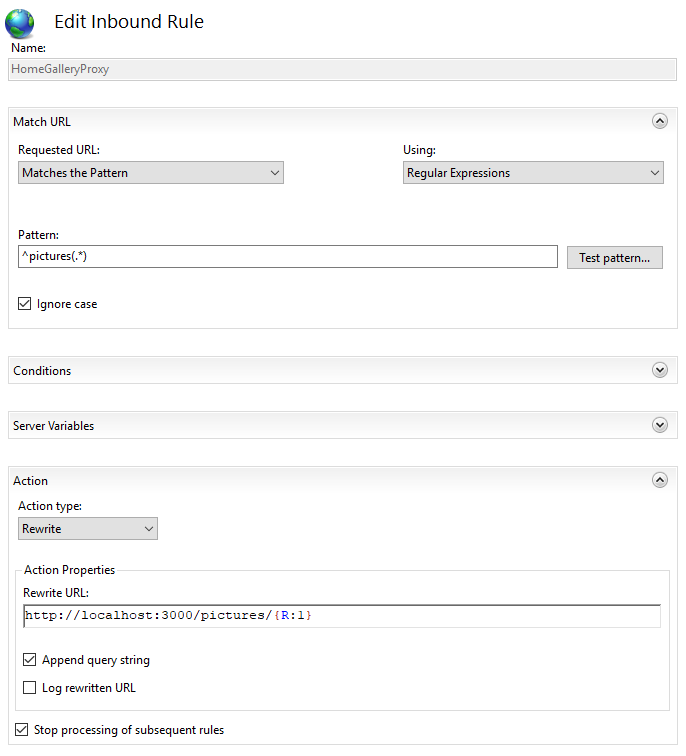

Use IIS Proxy With a Sub-Path
-----------------------------

Demonstrate how to use HomeGallery with IIS used as a proxy with base path ``/pictures``

Install URL Rewrite Module (if not already installed)
^^^^^^^^^^^^^^^^^^^^^^^^^^^^^^^^^^^^^^^^^^^^^^^^^^^^^

* Download and install Web Platform Installer from here `Web Platform Installer : The Official Microsoft IIS Site <https://www.microsoft.com/web/downloads/platform.aspx>`_
* Run Microsoft Web Platform Installer from the Start Menu.
* Search for “url rewrite”.
* Locate URL Rewrite 2.1 and click Add:
* Search for “application request routing”
* Locate Application Request Routing 3.0 and click Add.
* Click Install and "I Accept" to install the add in's
* Click Finish.

Enable ARR
^^^^^^^^^^

* In IIS Manager click on your server. Double-click Application Request Routing Cache:
* Click Server Proxy Settings in the Action pane.
* Check the Enable Proxy box.
* Click Apply in the Action Pane.

Setup Website (if it doesn't already exist)
^^^^^^^^^^^^^^^^^^^^^^^^^^^^^^^^^^^^^^^^^^^

Setup your root website in IIS Manager as normal with binding, e.g. www.mysite.com

This is the site you want to put your photos in a sub-path below.

Setup Url Rewrite for Proxy
^^^^^^^^^^^^^^^^^^^^^^^^^^^

With the new website selected double double-click URL Rewrite:

* Click Add Rule(s)… in the Action pane.
* Select to create a Blank Inbound Rule.
* Configure the rule as shown below:

* Click Apply.

Configure Home Gallery
^^^^^^^^^^^^^^^^^^^^^^

Configure the prefix in the server section of ``gallery.config.yml`` as follows:

.. code-block:: yaml
    :linenos:

    server:
        prefix: /pictures

Start (or restart) Home Gallery.

Test the Site
^^^^^^^^^^^^^

* Test the local site by opening `http://localhost:3000/pictures <http://localhost:3000/pictures>`_ in your browser.
* Test the remote site by opening `http://www.mysite.com/gallery` in your browser.

web.config File
^^^^^^^^^^^^^^^

The `web.config` file is shown below for reference:

.. code-block:: xml
    :linenos:

    <?xml version="1.0" encoding="UTF-8"?>
    <configuration>
      <system.webServer>
        <rewrite>
          <rules>
            <rule name="HomeGalleryProxy" stopProcessing="true">
              <match url="^pictures(.*)" />
              <action type="Rewrite"
                url="http://localhost:3000/pictures/{R:1}" />
            </rule>
          </rules>
        </rewrite>
        <urlCompression doStaticCompression="true" />
      </system.webServer>
    </configuration>