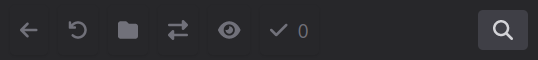

WebApp
======

Main Features

* View photo stream
* Search photo stream
* Edit tags
* `PWA <https://developer.mozilla.org/de/docs/Web/Progressive_web_apps/>`_ enabled (lightweight mobile app)

List View
---------

In the list view the photos and videos are shown in a fluent column based grid. By default
the sort order is by date, youngest first and shows all available media.

The sort order differs if similar images are shown.

Single View
-----------

By clicking a media in the list mode a single media is shown in the the single view.
You can tap/click the left and right array symbols to show the previous or next media.

.. image:: images/icon-prev.png

.. image:: images/icon-next.png

On mobile devices you can also swipe left and right on images to show the previous or next image. Use the pinch gesture
double tab to zoom into your image. In zoom view double tab resets the zoom.

On the bottom there are up to 3 icons:

.. figure:: images/icon-list.png

   Table icon: Show the list view

.. figure:: images/icon-similar.png

   Plant icon: Show list view filtered and sorted by similar images

.. figure:: images/icon-date.png

   Calender icon: Show list view with default order by date.

   The Calender icon is shown if any filter or none default search order is already applied

Edit Mode
---------

In edit mode basic tagging is supported. The edit mode can be entered by the pencil icon in the navivation bar
on the list view.

.. figure:: images/nav-main.png

   Navigation bar

.. figure:: images/nav-main-mobile.png

   Navigation bar in mobile view

   Navigation bar in edit mode

   Navigation bar in mobile edit mode

The edit mode is exited by clicking the back icon in the navigation bar of edit mode.

In edit mode you can select images in the list view by clicking and the selected media is highlighted.
Multiple media are selected by *ctrl* key and a mouse click or by pressing long tap on mobile device.
All media are selected between the last selected media and the current selected media by the selection
state of the last media. If the last media was selected, all media are selected. If the last media
was unselected, all media are unselected.

In the navigation bar of the edit mode you can invert the selection or select all or select none media.
To show all selected media click the eye icon.

After you are done the the selection you can assign tags to the selection by clicking the check icon.

   Edit dialog for multiple selected media

In the edit dialog you can add comma separated tags to the selected images. A minus prefix removes a tag.

The input *vacation, rome, -city* adds the tag *vacation* and the tag *rome* but removes the tag *city*.

.. note::
   After new tags are submitted, the current selection stays.
   You need to reset the selection by *Reset all* in the edit navigation bar manually if required.

You can also edit the tags from a single image via the details view

.. figure:: images/media-detail-view.png

   Media detail view

.. figure:: images/single-edit-tag-dialog.png

   Edit dialog for single media
