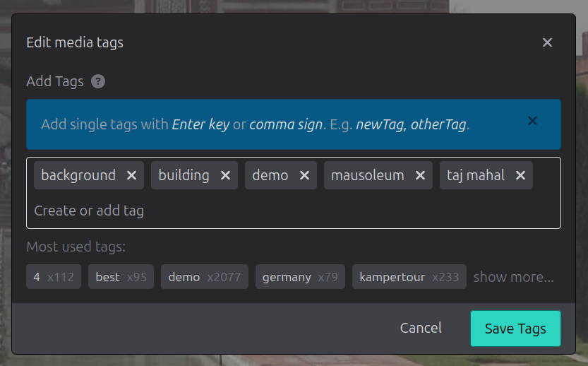

WebApp
======

Main Features

* View photo stream
* Search photo stream
* Edit tags
* `PWA <https://developer.mozilla.org/de/docs/Web/Progressive_web_apps/>`_ enabled (lightweight mobile app)

List View
---------

In the list view the photos and videos are shown in a fluent column based grid. By default
the sort order is by date, youngest first and shows all available media.

The sort order differs if similar images are shown.

Single View
-----------

By clicking a media in the list mode a single media is shown in the the single view.
You can tap/click the left and right array symbols to show the previous or next media.

.. image:: images/icon-prev.png

.. image:: images/icon-next.png

On mobile devices you can also swipe left and right on images to show the previous or next image. Use the pinch gesture
double tab to zoom into your image. In zoom view double tab resets the zoom.

On the bottom there are up to 3 icons:

.. figure:: images/icon-list.png

   Table icon: Show the list view

.. figure:: images/icon-similar.png

   Plant icon: Show list view filtered and sorted by similar images

.. figure:: images/icon-date.png

   Calender icon: Show list view with default order by date.

   The Calender icon is shown if any filter or none default search order is already applied

Search
------

The media list can be filtered and ordered by the search input on the nav bar in list mode.
A search term is tested by default agains a space separated basic text of
id prefix, media type, filename, date, camara vendor, camara model, geo names, tags and objects.
The search test is case insensitive.

By default each space separated word is a search term and all search term must be a part of the basic text.
A search term with a white space must be escaped by single or double quotations.
So the input of *san francisco* is treaded as *san and francisco* while *"san francisco"* is treaded as complete name with whitespace.

Search terms can be combined with boolean operands of *not*, *and*, *or* and parenthesis. Search
terms of *not*, *and* and *or* must be escaped by quotations.
Advance search terms like explicit tag search or aspect ratio comparison are listed below.

Date format is currenty in ISO 8601 format: *YYYY-DD-MM'T'hh:mm:ss* like *2020-09-23T08:24:54*

Search Examples
^^^^^^^^^^^^^^^

``berlin``

   Search for filename, address or tag containing search term *berlin*

``berlin tower``

   Is the same as ``berlin and tower``. Search for filename, address or tag containing search term *berlin* and term *tower*

``city:berlin or tower``

   Search for images in the city *berlin* or having *tower* in filename, address or tag

``city:berlin not tower``

   Search for images in the city *berlin* and not haveing *tower* in filename, address or tag

``tags in (vacation, family)``

   Search for all images with tags *vacation* **or** *family*

``tags all in (vacation, family)``

   Search for all images with tags *vacation* **and** *family*

``type:video year in [2015:2020] order by duration``

   Is the same as ``type:video and year in [2015:2020]``. Search all media type of *video* within the years between 2015 and 2020 with longest video first.

``ratio:landscape``

   Lists all media in landscape orientation

``not exists(geo)``

   Lists all images whithout geo information via latitude or longitude

``order by count(faces)``

   Lists all images with detected faces, most faces first

Query BNF
^^^^^^^^^

The query language follows following backus naur form.

``?`` is optional. ``|`` is an alternative

Query
  Terms OrderBy? | OrderBy

Terms
  Term Terms?

Term
  Term ``or`` Term | Term ``and`` Term | ``not`` Term | ``(`` Terms ``)`` | Expression

Expression
  KeyValueExpression | CmpExpression | CountFnExpression | ExistsFnExpression | ListExpression | RangeExpression | Value

KeyValueExpression
  Identifier ``:`` Value

CmpExpression
  Identifier Operand Value

CountFnExpression
  ``count(`` Identifier ``)`` Operand Value

ExistsFnExpression
  ``exists(`` Identifier ``)``

ListExpression
  Identifier ``in (`` Values ``)`` | Identifier ``all in (`` Values ``)``

RangeExpression
  Identifier ``in [`` Value ``:`` Value ``]``

Operand
  ``=`` | ``<`` | ``<=`` | ``>`` | ``>=`` | ``!=`` | ``~``

Values
  Value Values?

Value
  "double quoted value" | 'single quoted value' | *text or number*

Identifier
  *text*

OrderBy
  ``order by`` OrderExpression OrderDirection?

OrderExpression
  *see order expressions below below*

OrderDirection
  ``asc`` | ``desc``

Operands
^^^^^^^^

Following operands are used for comparison

.. csv-table:: Operands
   :file: search-operands.csv
   :widths: auto
   :delim: ;
   :header-rows: 1

Number operands
  ``:``, ``=``, ``<``, ``<=``, ``>``, ``>=``, ``!=``, ``in [from:to]``

Text operands
  ``:``, ``=``, ``!=``, ``~``
  
List operands
  ``in (value, ...)``, ``all in (value, ...)``

Advance Search Terms
^^^^^^^^^^^^^^^^^^^^

.. csv-table:: Avance Search terms
   :file: search-terms.csv
   :widths: auto
   :delim: ;
   :header-rows: 1

Order Expressions
^^^^^^^^^^^^^^^^^

The search result can be ordered by following expressions

.. csv-table:: Order expressions
   :file: order-expressions.csv
   :widths: auto
   :delim: ;
   :header-rows: 1

Edit Mode
---------

In edit mode basic tagging is supported. The edit mode can be entered by the pencil icon in the navivation bar
on the list view.

   Navigation bar

   Navigation bar in mobile view

.. figure:: images/nav-edit.png

   Navigation bar in edit mode

.. figure:: images/nav-edit-mobile.png

   Navigation bar in mobile edit mode

The edit mode is exited by clicking the back icon in the navigation bar of edit mode.

In edit mode you can select images in the list view by clicking and the selected media is highlighted.
Multiple media are selected by *ctrl* key and a mouse click or by pressing long tap on mobile device.
All media are selected between the last selected media and the current selected media by the selection
state of the last media. If the last media was selected, all media are selected. If the last media
was unselected, all media are unselected.

In the navigation bar of the edit mode you can invert the selection or select all or select none media.
To show all selected media click the eye icon.

After you are done the the selection you can assign tags to the selection by clicking the check icon.

.. figure:: images/multi-edit-tag-dialog.png

   Edit dialog for multiple selected media

In the edit dialog you can add comma separated tags to the selected images. A minus prefix removes a tag.

The input *vacation, rome, -city* adds the tag *vacation* and the tag *rome* but removes the tag *city*.

.. note::
   After new tags are submitted, the current selection stays.
   You need to reset the selection by *Reset all* in the edit navigation bar manually if required.

You can also edit the tags from a single image via the details view

   Media detail view

   Edit dialog for single media
